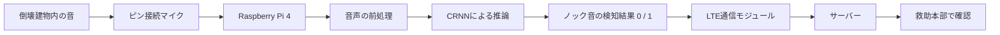
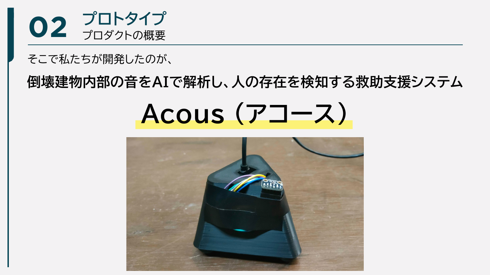
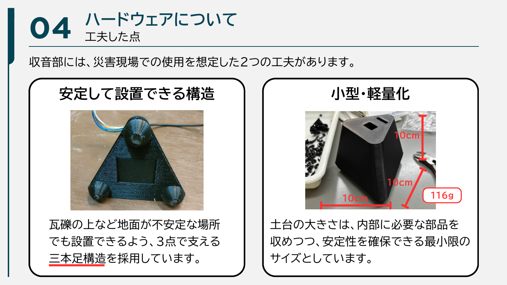
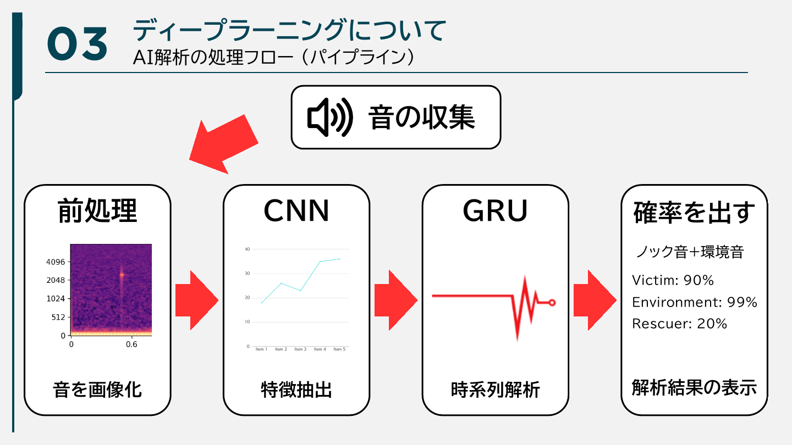

# Acous

倒壊建物内のノック音をAIで検知し、救助本部へ遠隔通知するための災害救助支援システムです。

- プロジェクト名: **Acous**
- チーム名: **venv**
- 所属: **大阪公立大学工業高等専門学校**
- 出場大会: **DCON2026**
- リポジトリの位置付け: **DCON2026出場時のAI開発成果を保存するアーカイブ**

> [!IMPORTANT]
> 本リポジトリは当時の研究・開発過程を記録するためのものです。実運用可能な救助システムとして公開するものではなく、人命に関わる判断への使用を想定していません。学習データ、ラベルCSV、学習済みモデル、旧コードの一部は公開対象に含めていません。

## Acousを作った理由

地震などで建物が倒壊した場合、内部に取り残された人の位置や生存状況を外部から把握することは困難です。要救助者は、声を出せない状況でも、手元にある物や周囲の壁・床などをたたくことで、自分の存在を知らせようとする可能性があります。

Acousは、このような**ノック音**をAIで検知することを目的として開発しました。マイクとAIを搭載したデバイスを倒壊建物内に設置し、隊員が常時付き添わなくてもデバイス単独で周囲の音を収集・判定できる仕組みを目指しました。ノック音を検知した結果はLTEによってサーバーへ送信し、離れた救助本部から確認できる構成です。

目標は、救助隊員が直接立ち入り続けることが難しい場所でも継続的に探索を補助し、要救助者を発見するための情報を増やすことでした。AIの判定だけで救助活動を決定するのではなく、現場で活動する人の判断を支援するための一つのセンサーとして位置付けています。

## システムの全体像

実機にはRaspberry Pi 4、ピン接続したマイク、LTE通信モジュールを使用しました。マイクで取得した音声をRaspberry Pi 4上のAIモデルへ入力し、検知結果を0または1のデータに変換してサーバーへ送信する流れです。

本リポジトリの `model.py` には、マイクまたはシリアル入力、AI推論、判定結果の画面表示、Appwriteへの通知を組み合わせた開発・検証用コードが残されています。DCONで使用したハードウェア全体のコードを完全に収録したものではありません。

### 当時のプロトタイプ

*Acousのプロトタイプ。倒壊建物内部の音を収集するマイクと、3Dプリンターで製作した収音部を組み合わせています。出典: チームvenv「DCON2026 説明資料」p.7。*

収音部は、瓦礫のような不安定な場所にも置きやすいよう3点で支える構造としました。内部の部品を収めながら小型化し、当時の試作では約10 cm四方、116 gの筐体を製作しました。

*収音部の三本足構造と小型・軽量化。出典: チームvenv「DCON2026 説明資料」p.21。*

## AIが判別する音

モデルは、1つの音声に複数の種類の音が含まれる状況を扱うため、次の3クラスを持つマルチラベル分類モデルとして設計しました。

| クラス | このプロジェクトでの意味 |
| --- | --- |
| `victim` | 倒壊建物内の要救助者が周囲をたたいて発するノック音 |
| `environment` | 工事音、機械音、環境音など、災害現場で混入し得る背景音 |
| `rescuer` | 救助隊員や救助活動に由来する音 |

ここでの `victim` は、人の声やあらゆる生体音を意味するものではなく、Acousが検知対象としたノック音を表します。

## モデルと音声処理

### 入力と前処理

学習・推論とも、主に次の条件で音声を処理します。

- サンプリングレート: 16 kHz
- 入力長: 1.5秒
- バンドパスフィルタ: 100–4,000 Hz
- 特徴量: 64次元のlog-melスペクトログラム
- FFTサイズ: 1,024
- ホップ長: 256
- 正規化: 平均を引き、標準偏差に0.1を加えた値で除算

標準偏差へ0.1を加える処理は、静かな区間で小さなノイズが過度に強調されることを抑えるために導入しました。

### Attention CRNN

モデルは、畳み込みニューラルネットワークと再帰型ニューラルネットワークを組み合わせたCRNNです。

1. 3段の畳み込み層で、log-melスペクトログラムから局所的な時間・周波数パターンを抽出します。
2. 双方向GRUで、前後の時間的な変化を捉えます。
3. Attention Poolingで、短時間に現れるノック音のような重要な区間へ重みを付けます。
4. 全結合層から3クラスのスコアを出力し、Sigmoidによってクラスごとの確率へ変換します。

*音の画像化、CNNによる特徴抽出、GRUによる時系列解析、クラス別確率の出力という当時の説明図。図中の確率は処理例であり、モデル全体の評価値ではありません。出典: チームvenv「DCON2026 説明資料」p.14。*

畳み込み部のチャンネル数は16、32、64、双方向GRUの隠れ層サイズは64です。学習には `BCEWithLogitsLoss` を使用し、少数クラスの影響が失われにくいよう、各クラスの出現数から算出した重みを与えています。

### 学習時の工夫

限られた音声から条件の異なるデータを作るため、学習時には次の拡張を確率的に適用しました。

- ピッチの変更
- 再生速度の変更
- ランダムノイズの付加
- ノック音と環境音の合成
- クラスの偏りを考慮した損失の重み付け
- 検証F1スコアに基づく学習率の調整とEarly Stopping

実機推論では、瞬間的なスコアだけで通知しないよう直近3回の推論結果を移動平均し、`victim` の平均スコアが0.95以上になった場合に通知します。短時間で通知が連続しないよう、1.5秒のクールダウンも設けています。

## データ作成で重視したこと

この開発で最も難しかったのは、災害現場に近い音声データを用意することでした。実際の倒壊現場で網羅的に音を収集することは難しく、一般的な音声認識データだけでは現場の複雑な音環境を再現できません。

そこで、次のような方法でデータの多様性を確保しました。

- ノックの強さ、材質、鳴らし方などに変化を持たせて収録する
- 消防隊が災害を想定して行う救助訓練動画の音声を参考・素材として利用する
- 工事現場など、倒壊現場で想定される騒音を環境音として使用する
- 元音声へノイズを付加する
- ノック音と環境音を異なる音量比で合成する
- 2クラスを合成した音声へ複数ラベルを付ける
- 合成音を実際に聞き、人が採用または却下する

`mixer.py` では、ノック音のピークを中心に1.5秒を切り出し、環境音はランダムな位置から切り出します。その後、ノック音を0.7–1.0、環境音を0.1–0.4の範囲で重み付けして合成します。生成結果は自動的にすべて採用せず、再生して確認したうえでラベル付きデータへ追加する方式にしました。また、どの音声同士を合成したかを記録し、同じ組み合わせを重複して確認しないようにしています。

データの量を増やすだけではなく、「実際の現場でノック音がどのように埋もれるか」を意識してデータを作ったことが、本プロジェクトのAI開発で最も重視した点です。一方で、現実の災害現場を完全に再現できるわけではなく、このデータ作成方法そのものがモデル評価の限界にもつながっています。

## 開発担当

本リポジトリの作成者は、AcousのAI部分について、次の範囲をほぼ一貫して担当しました。

- モデル構成の検討と実装
- 音声データの収集
- 音声の切り出し、加工、ミキシング
- マルチラベルのアノテーション
- 学習処理の実装と調整
- 学習後のモデル検証

Raspberry Pi 4などのマイコン・実機への搭載については、チームメンバー1名と協力して取り組みました。

## DCON2026での成果

DCON2026では、約90チームの中から本選会場へ進む30チームに選出されました。会場でプレゼンテーションを行う10チームには残れませんでしたが、Acousのポスター展示を行い、約100人の来場者へ開発内容を説明しました。

モデルは、学習データと比較的近い条件ではあるものの、ノック音の種類に多様性を持たせて収集したテストデータにおいて、**約0.90のF1スコア**を記録しました。この数値は当時の開発内評価であり、未知の災害現場に対する性能や、第三者による独立した評価を示すものではありません。

ポスター展示では、災害救助を扱うテーマと、デバイスが単独で探索を補助する仕組みに強い関心を持っていただきました。一方で、次のような重要な意見も得ました。

- マイクで音を拾える範囲には限界があるのではないか
- 救助活動がAIの精度に依存してよいのか
- 学習時と異なる実際の災害現場でも同じ精度を出せるのか

これらは開発チーム自身も認識していた課題であり、プロダクトの前提や評価方法を見つめ直す機会になりました。

## 消防での実演

開発したデバイスを消防へ持ち込み、救急隊の方々の前で実演する機会をいただきました。隊員がデバイスに付き添わなくても単独で動作し、収集した情報を救助本部へ遠隔送信する構想については、「完成すれば救助活動に役立つと思う」という高い評価をいただきました。実際の救助活動に関わる方から必要性を認めていただけたことは、大きな成果でした。

その一方で、ノック音を鳴らしていないにもかかわらず検知信号を送る誤検知も発生しました。救助活動で使用するにはモデルの判定に対する十分な信頼性が必要であり、当時のAcousはまだ実用段階には達していないという結論になりました。

## 残された課題

- **実環境との違い**: 訓練動画、工事音、合成音などで現場へ近づけましたが、実際の倒壊建物内の音響条件とは差があります。
- **誤検知**: ノック音ではない衝撃音や環境音を `victim` と判定する場合があります。
- **見逃し**: 遠い場所や遮蔽物の向こうで鳴った小さなノック音を取得できない可能性があります。
- **収音範囲**: AI以前に、マイクへ音が届かなければ検知できません。マイクの数、配置、感度、筐体による影響の検証が必要です。
- **評価データ**: 実際の災害現場を代表する、独立した十分な規模のテストデータがありません。
- **AIへの依存**: 判定結果は救助判断を補助する情報として扱い、他の探索手段や人による確認と組み合わせる必要があります。
- **通信の信頼性**: 倒壊建物内でLTE通信が安定して利用できるか、通信不能時にどう記録・再送するかの検討が必要です。

## ファイル構成

| ファイル | 内容 |
| --- | --- |
| `model.py` | Raspberry Pi 4を意識した推論・デモ用コードです。マイクまたはシリアル音声入力、特徴抽出、モデル推論、移動平均、GUI表示、Appwrite通知をまとめています。 |
| `record.py` | 16 kHz・モノラルでノック音などを録音するためのツールです。 |
| `split.py` | 長い音声を1.5秒単位へ分割し、対話形式でラベルを付けるデータ作成ツールです。 |
| `update.py` | 新しく録音したWAVを確認し、ラベル情報へ追加するツールです。 |
| `mixer.py` | ノック音と環境音を合成し、試聴・選別しながらマルチラベルデータを作るツールです。 |
| `requirements.txt` | 当時のPython依存ライブラリを記録したファイルです。バージョンは固定されていないため、環境を完全に再現するものではありません。 |

## 公開していないもの

次のファイルは容量、権利、プライバシー、またはアーカイブとしての整理方針を考慮し、`.gitignore` で公開対象から除外しています。

- 収集・録音・分割・合成した音声データ
- 元動画などの大容量メディア
- マルチラベルのCSV
- 学習済みモデルとチェックポイント
- 仮想環境、キャッシュ、ログ、ローカル設定
- 現在の公開対象コードより前に作成した旧コード

音声データには外部素材や現場を想定して収集したデータが含まれるため、本リポジトリからの再配布は行いません。CSVも、非公開の音声ファイル名やデータ作成履歴と結び付くため公開しません。

## アーカイブとしての注意

- コードはDCON2026出場時点の開発過程を残したものです。
- セットアップ手順や動作保証は提供していません。
- 学習データと学習済みモデルを含まないため、このリポジトリだけで当時の結果を再現することはできません。
- `model.py` のAppwrite設定は開発時の構成を示すもので、プロジェクトID、データベースID、コレクションID、APIキーは公開用のプレースホルダーへ置き換えています。
- 実際の災害救助、人命に関わる監視、製品運用には使用しないでください。

## 権利について

本リポジトリにはオープンソースライセンスを付与していません。著作権者から個別に許可を得た場合を除き、コードや文章の複製、改変、再配布、商用利用を許可するものではありません。外部由来の音声・動画素材に関する権利は、それぞれの権利者に帰属します。

Copyright © 2026 Team venv. All rights reserved.
